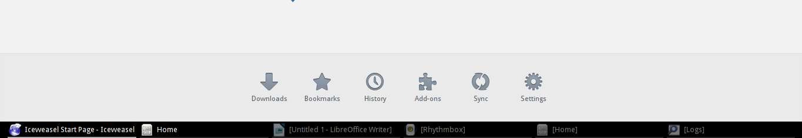

i3-config
==========

These configuration files are for:

  - i3 (dmenu, i3lock, conky…),
  - git
  - byobu
  - fontconfig
  - sublime-text
  - qnapi
  - gtk3.0
  - qnapi
  - redshift
  - terminator
  - modified default gnome3 appearance
  - modified window-list extension for gnome3, not ugly anymore

### window-list modified extension for gnome3 ###
Gnome 3 has classic mode, that try to looks like Gnome 2. Unfortunately, it uses bright colors, but hey, it's just bunch of extensions for regular Gnome. By default, window-list is ugly, therefore I changed it a little bit to make sleek panel.

Don't turn on windows grupping, don't use it in Gnome Classic.

### i3 ###
requirements for Debian:
````
i3 terminator conky xbacklight xautolock i3lock libnotify-bin x11-utils xfonts-terminus
````
