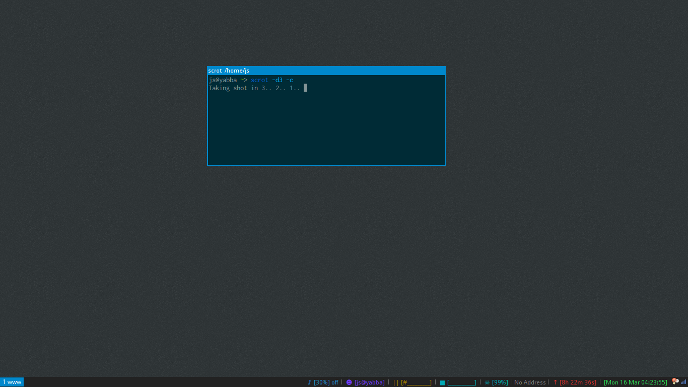

i3-configs
==========

These configuration files are for the popular X11 tilling window manager, i3. 

~~[This](http://www.reddit.com/r/unixporn/comments/1cvsgv/archi3_finally_done_setting_up_my_conky_i3status/) is how this configuration should look. (note, there have been a few changes since then. You'll have to download or check commits to see what they are.)~~ See above.

The Files
---------

* .i3/config - the main i3 config file containing key bindings and colours for windows.
* .i3/conky - tells conky what config to use, gives version.
* .i3/conkyrc - the conky config for i3status.

* .scripts/cmusconk.sh - used to display current cmus track in i3status.
* ~~.scripts/vol.sh - used to get volume percentage for i3status. May need to customize for your own setup. Allows for things like changing [0%] -> [MUTE] with simple if statement.~~ Reduntant. Although the current setup will show [0%] instead of [MUTE], it is now much smaller and runs within conky.

Installation
------------

If you'd like to install this, clone the repo and move everything to the appropriate places. Make sure you have everything that's needed installed.

My own .xinitrc file contains simply "exec i3". 

Make sure feh is installed and set your wallpaper for the first time with "feh --bg-fill /path/to/file". This will create ~/.fehbg which i3 will run upon startup. .fehbg will automatically update whenever you run feh to change the wallpaper again.

I've used GTK themes and installed GNOME so I have full support for them and for a few other reasons. Install gnome-tweak-tool and you can customize your theme settings. i3 runs gnome-settings-daemon upon startup. I also use gnome-terminal for the easy customization (ex: colour and transparent background) and other features like tabs and search. You can turn off gnome-terminal's menubar in the profile settings to give it more of a rxvt/i3-sensible-terminal look.

Credits
-------

This repo was forked from [here](https://github.com/ivyl/i3-config).

Other
-----

That's all. Hopefully I didn't miss anything! If you try this out and it doesn't look like the example above, something's maybe not installed, needs customized for your system or I forgot to include a file (in which case, create a new issue).
